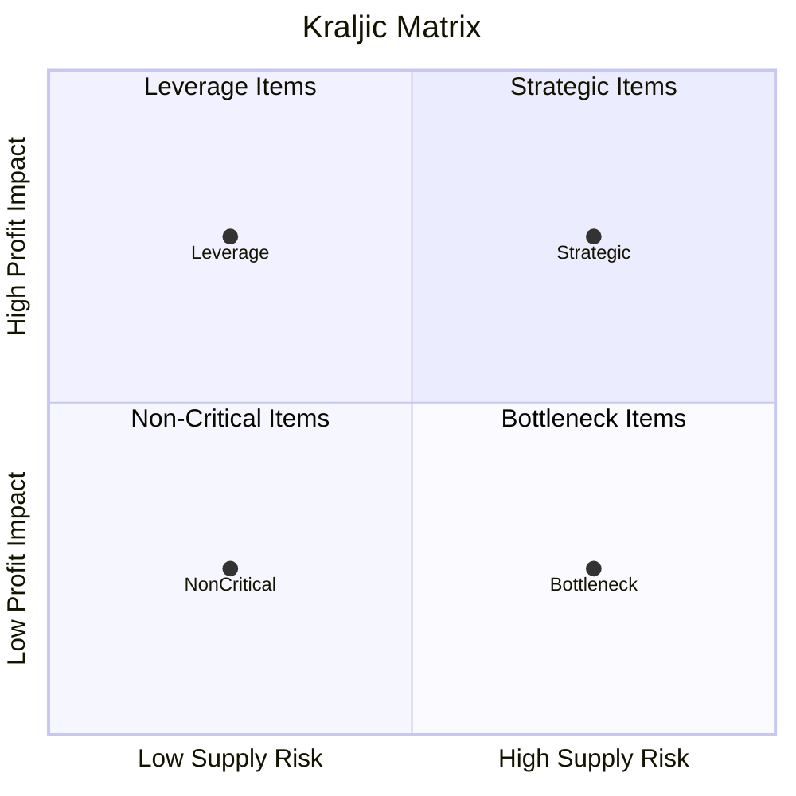

# Supply Chain Management

### Course4 Module 1
### Supply Chain Sourcing

__Why Supply Chain Sourcing?__
> Supply chain sourcing is the part of supply chain management that deals with managing relationships with all the firm's suppliers. It is one of the essential pieces of understanding how a well-functioning supply chain is built.

__Purchasing__
> Purchasing generally refers to the activity of buying goods and service
> Purchasing（采购）通常指的是具体的购买行为本身，更偏向执行层面，关注的是“怎么买、是否买到、钱是否付完”。

> __Purchasing Componets__
> 1. Processing purchase orders
> 创建、发送、修改 PO（Purchase Order）
> 2. Receiving and monitoring advance shipment notices
> 确认供应商是否按时发货、在途状态
> 3. Confirming receipt of goods
> 仓库或系统中确认货物已到达
> 4. Processing invoices
> 核对发票与PO、收货记录是否一致（三方匹配）
> 5. Paying suppliers
> 按合同条款完成付款流程

__Procrument__
> Procurement is a broader, strategic process that includes purchasing but also covers supplier selection, negotiation, contracting, and long-term supply planning.
> Procurement（采购管理 / 战略采购）是一个更高层级、更全面的概念，不仅包含购买行为，还包括：
> 选择谁来供应
> 如何谈价格与合同
> 如何控制成本与风险
> 如何建立长期供应关系

__Kraljic Matrix（克拉利奇矩阵）__
> 一种 采购组合分析模型（Purchasing Portfolio Model）。
> 它用于帮助企业根据：
> Profit Impact（利润影响）
> Supply Risk（供应风险）
>将采购物料分类，从而制定不同的采购策略。

> 并不是所有物料都要拼命压价。
> 有些要谈价格（Leverage），
> 有些要保供应（Bottleneck），
> 有些要建战略联盟（Strategic）。

1. __Non-Critical Items（非关键物料）__
> 低利润影响 低供应风险
> 📌 特点：
> 标准化产品 替代品多 金额小
> 📌 策略：
流程自动化 减少行政成本 批量采购
> __Focus on process efficiency and cost reduction.__

2. __Leverage Items（杠杆物料）__
> 高利润影响 低供应风险
> 📌 特点：
> 采购金额大 市场竞争充分 (供应商多、替代性强)
> 📌 策略：
> 强势谈判 集中采购 竞价
> __Use buying power to negotiate better prices.__

3. __Bottleneck Items（瓶颈物料）__
> 低利润影响 高供应风险
> 📌 特点：
> 金额不高 但供应商少或技术专用
> 📌 策略：
> 增加安全库存 建立长期合作 双重供应
> __Secure supply and reduce risk.__

4. __Strategic Items（战略物料）__

> 高利润影响 高供应风险

> 📌 特点：
> 关键核心零件 技术复杂 替代难
> 📌 策略：
> 战略合作伙伴关系 联合开发 长期合同
> __Build strategic partnerships.__

__Supplier Segmentation（供应商细分）__
> Supplier segmentation is the process of categorizing suppliers based on their strategic importance, risk level, performance, and business impact in order to apply differentiated supplier management strategies.
> 供应商细分是指根据供应商对企业的战略重要性、风险水平、绩效表现和业务影响，将供应商分层管理，从而采用不同的合作与管理策略。
> 企业通常有：数百甚至上千家供应商 但资源有限 因此必须区分：
> 哪些要重点管理 哪些只需基本交易管理

__常见细分维度__
1. Spend（采购金额）
> 高支出供应商 低支出供应商
2. Supply Risk（供应风险）
> 替代性
> 技术复杂度
> 地缘风险
3. Strategic Importance（战略重要性）
> 是否影响核心产品
> 是否影响竞争优势
4. Supplier Performance（供应商绩效）
> 交付准时率
> 质量
> 成本控制

__Single versus Multiple Sourcing__
> __Single Sourcing（单一供应）__
> Single sourcing means a company purchases a particular item from one supplier only.
> ✅ 优点
> 规模经济（Economies of scale）
> 更低价格
> 流程简化
> 深度合作与技术共享
> 质量一致性更高

> ❌ 缺点
> 断供风险高
> 议价能力下降
> 供应商依赖性强
> 地缘政治或自然灾害风险集中

> __Multiple Sourcing（多供应）__
> Multiple sourcing means a company purchases the same item from two or more suppliers.
> ✅ 优点
> 降低断供风险
> 保持价格竞争
> 灵活性更强
> 供应能力更稳定

> ❌ 缺点
> 成本较高
> 质量可能不一致
> 管理复杂
> 分散订单影响规模效应

__Contract manufacturers(代工厂)__
> Contract manufacturers (CMs) are third-party companies that produce goods on behalf of another company under a formal manufacturing agreement.
> (代工厂 / 委托制造商) **是指根据品牌方的设计和技术要求，代为生产产品的第三方制造企业。
> 品牌方：
> 负责设计 负责品牌 负责销售 控制知识产权
> 代工厂：
> 负责生产 负责装配 负责运营制造流程